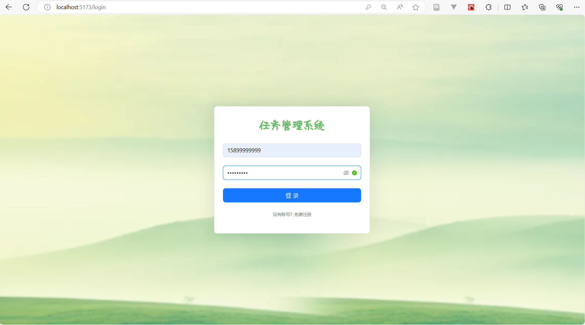
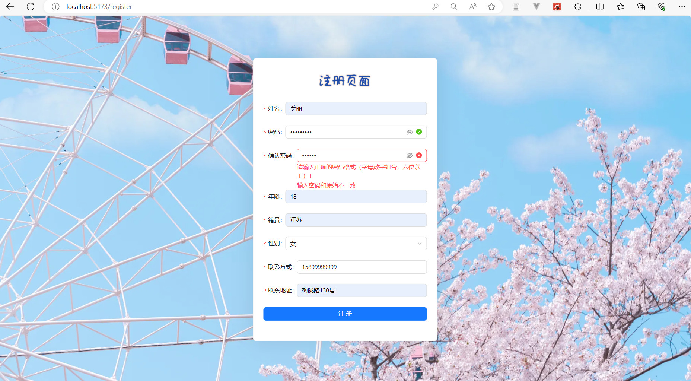
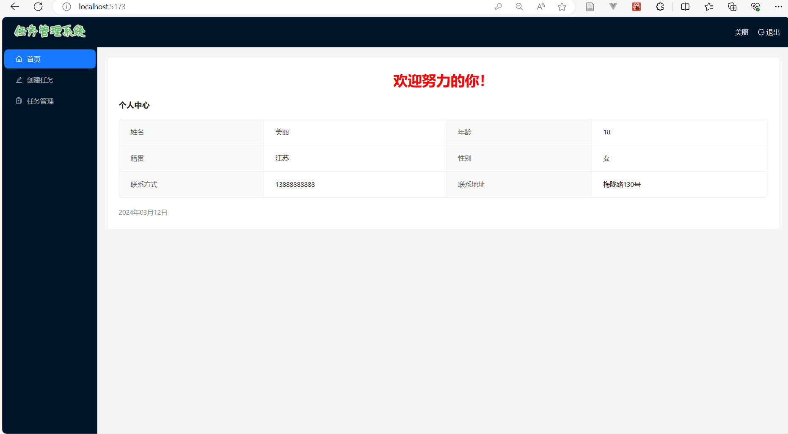
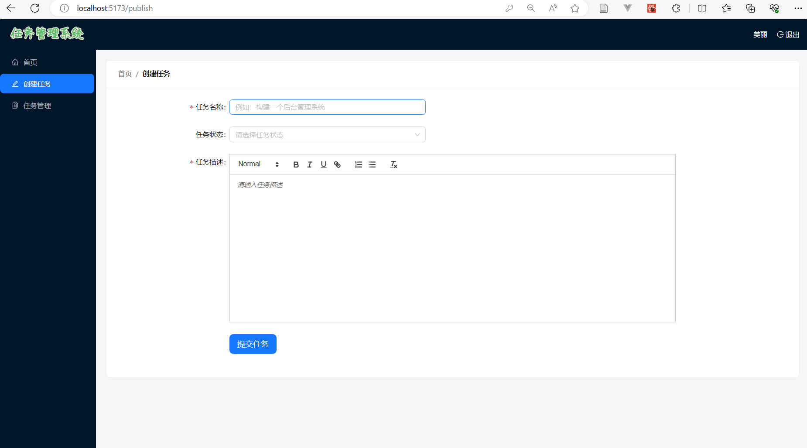
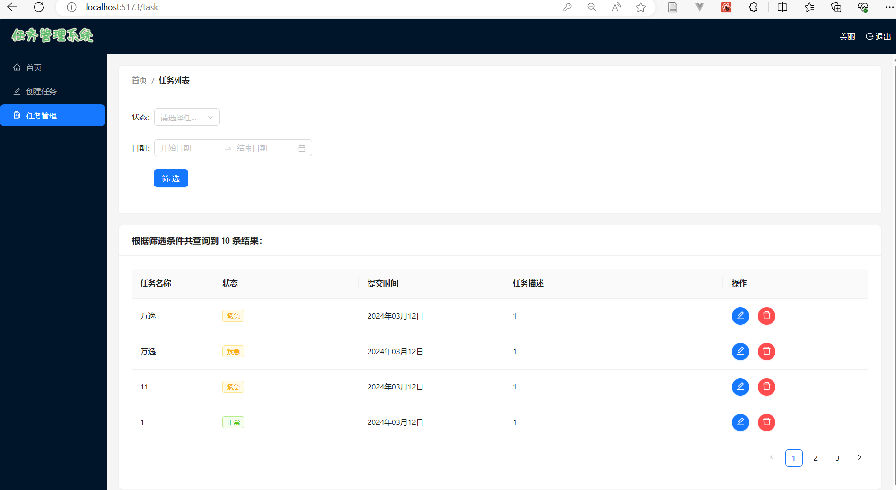

# 任务管理系统
（应成峰、万逸合作开发）
## 项目分为前台（react_project）和后台（react_e）部分

## 视频演示
<video controls src="任务管理系统演示视频.mp4" title="Title"></video>

## 前台（react_project）页面功能介绍
### 1.概述
* 前端展示引入Ant Design，进行页面的布局以及样式的美观
* 系统内部使用Layout布局，协助进行页面级整体布局，主题为dark
* 用户登录成功后，进入系统，浏览器返回时不会回到登录页面
* 使用token进行登录状态保持
### 2.Login页面

* 登录页面采用绿色系的背景图，有春和景明的意象，满满的生机勃勃。
* 系统名称为朴素的“任务管理系统”，logo精心设计，绿色和淡黄的色调，和背景相得益彰
* 已经注册的用户可以根据手机号和密码登录系统，手机号和密码均有表单验证，符合手机号和密码（字母+数字，且六位数字以上）的格式要求；
* 没有注册的用户无法进入系统，会提示“请注册账号”。
* 没有注册的用户根据自己的内心意愿，可以选择注册成为新用户，点击登录下* 方的“没有账号？免费注册”，进入注册页面；同时也可以选择关闭浏览器，当做没有来过。

### 3.Register页面

* 注册页面采用粉色系的背景图，粉色的樱花，是浪漫的，希望用户在注册感受春日美好、温暖、温柔
* 注册页面logo精心设计，蓝色和粉色莫兰迪色调搭配，饱和度低，很有亲和力
* 页面包含：姓名、密码、年龄、籍贯、性别、联系方式、联系地址的信息，每一个表单都有表单验证，出于安全考虑以及担心用户密码设置有差错，密码需要输入两次一致，才可以注册
* 注册完毕后返回登录页面

### 4.Home页面

* Home页面展示用户个人信息，个人用户信息是从数据库里调用，为当前用户注册时的个人信息
* 红色的主标题：“欢迎努力的你”，给每位用户鼓励

### 5.Publish页面

* 创建任务页面主要功能是创建一个新的任务，包括任务名称、任务状态（any,normal,emergency）、任务描述，同意具有表单验证，完成后点击“提交任务”的按钮
* 当用户点开了创建任务，但是不想创建任务的时候，可以点击左上角的“首页”，回到Home页面，给自己加加油！
* 任务名称一般为简介的任务命名，比如构建一个后台管理系统，或者是看一部电影
* 任务状态，一般设置为normal或者是emergency，代表任务的紧急程度；而选择any的用户，说明用户没有任何的想法，也很不错，我们提供这样一个机会
* 任务描述，引入富文本编辑器，可以方便对大段文字进行简单的排版等，用户可以自己探索一下，增加系统的设计感
* 提交按钮，当用户的任务已经创建完毕，点击按钮，跳转到任务管理页面，进入项目管理页面

### 6.Task页面

* 任务管理列表主要功能是展示任务，对任务列表进行筛选，对任务进行编辑和删除操作
* 同样具有左上角的“首页”，回到Home页面，给自己加加油的功能
* 筛选功能提供任务的状态和时间筛选，可以两个条件同时筛选，也可以单独条件筛选
* 任务列表展示筛选任务数量，以及创建任务时的任务名称，状态，提交时间，任务描述
* 操作包含编辑和删除，用户点击编辑按钮时候，可以跳转到创建任务页面，进行任务的修改；点击删除按钮时，任务消失，再也不用做这个任务啦！！！
* 用户可以点击退出按钮，此时清除用户信息，并返回到登录页面，没有任何登录信息

## 后台（react_e）部分
* 技术栈：Express+NodeJS+Mongodb
* 设计任务管理系统的数据结构，包括用户信息UserInfo、任务Task
* 使用MongoDB数据库，连接到NodeJS项目中
* 创建了任务接口，实现对任务的增、删、改、查，接收前台发来的筛选条件、返回指定的筛选任务结果
* 创建用户相关的接口，包括用户的注册接口、登录接口，对密码进行哈希加密，登录成功后会返回Token给前台。